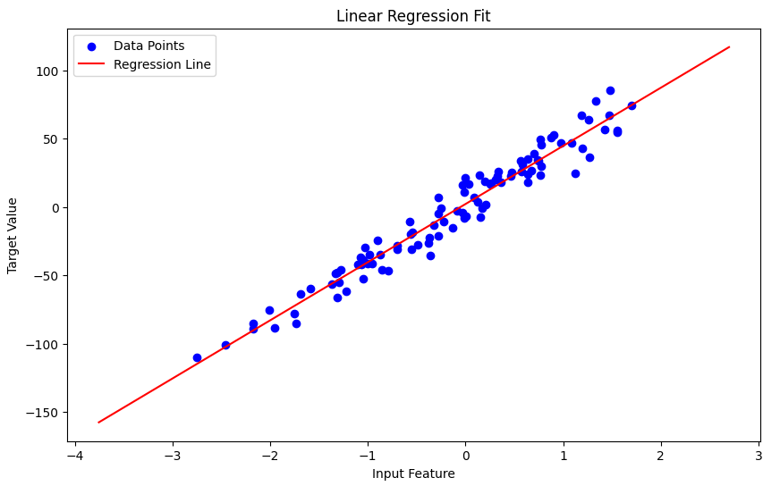
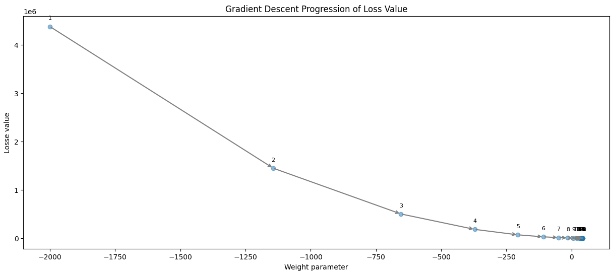

# Linear Regression Model from Scratch

This repository demonstrates the foundational principles of developing a linear regression model entirely from scratch. The project encompasses the construction and visualization of a linear regression algorithm, including the essential components of feed-forward computation and backpropagation for model training. The approach is hands-on, focusing on understanding the underlying mechanics of linear models and gradient-based optimization.

## Overview

- **Value Class**: Inspired by Andrej Karpathy's [micrograd project](https://github.com/karpathy/micrograd), the `Value` class is central to the framework, encapsulating a scalar value and its gradient. It's vital for constructing the autograd graph, enabling efficient execution of forward operations and the backward propagation of gradients

- **Hypothesis Function**: Articulates the linear regression formula \(y = xw + b\), with \(w\) and \(b\) as parameters, to predict outcomes. It defines the model's structure for making predictions.

- **Graph Visualization**: Leverages `graphviz` to depict the model's computational graph, aiding in comprehending data and gradient flows for easier debugging and learning.

   

- **Optimization Loop**: Illustrates model training via gradient descent, iteratively refining parameters to reduce loss, demonstrating the adjustments for error minimization.

    

- **Loss Function**: Adopts Mean Squared Error (MSE) to evaluate model precision, measuring the discrepancy between predictions and actual targets, serving as the optimization criterion.

   

## Getting Started

To explore the linear regression model, clone this repository and run the `demo.ipynb` notebook (or open in [Google Colab](https://colab.research.google.com/github/Farhad-Davaripour/Linear_regression_Core_Principles/blob/main/demo.ipynb)
). The notebook is structured to guide you through each step of the model development process, from generating synthetic data to training the model and visualizing its performance.

## Conclusion

This project offers a deep dive into the mechanics of linear regression, providing a solid foundation for understanding machine learning algorithms' basic principles. By building the model from scratch, it encourages a hands-on approach to learning, demystifying the complexities behind machine learning models.
